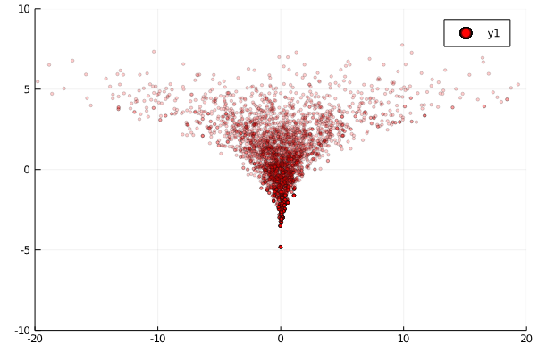
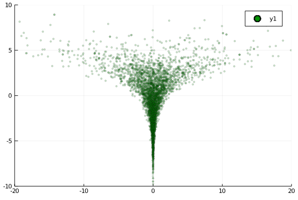

# Neals_Funnel
A small turing example demonstrating the problem of Reparameterization by sampling from Neals Funnel

## Reparameterization 
Please read [this](https://mc-stan.org/docs/2_24/stan-users-guide/reparameterization-section.html) to understand what reparameterization is and why it's important

## Neals Funnel
Take an example distribution
```
y ~ N(0,3)
x ~ N(0, exp(y/2))
```
* HMC based samplers seems to have problems sampling form the neck part of this funnel
* Once once we reparametrize this distn like this  
```
y_raw ~ N(0,1)
x_raw ~ N(0,1)
y ~ y_raw*3.0
x ~ x_raw*exp(y/2)
```
HMC is able to sample the region properly

## Results
### Non Centered Sampling


### Centered Sampling (Reparametrized)



We can clearly see the difference here.  

To reproduce have a look at `Neals Funnel.ipynb`
